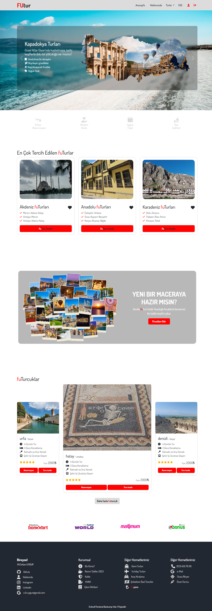
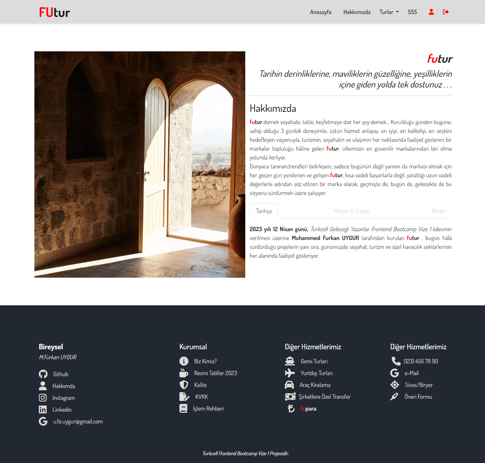
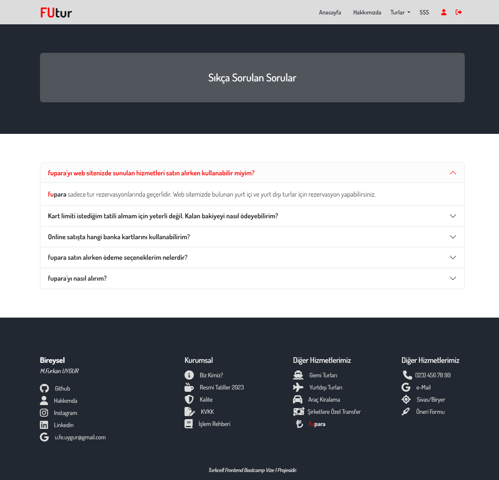

# Vize 1 / Bootstrap-SCSS-HTML

 <h3>Verilen e-ticaret konulu ödev çerçevesinde proje konusu turizm üzerine belirlenmiş olup kullanıcıların seçebilecekleri tur çeşitleri bulunmaktadır. </h3>
 

 <h2 style="color:white">Kullanılan Teknolojiler</h2>

  
  
  
      
  

 

 <h2 style="color:white">Proje kapsamında oluşturulan sayfalar</h3>
 <ul>
    <li>
        Anasayfa ( homepage.html )
    </li>
    <li>
        Hakkımızda ( about.html )
    </li>
    <li>
        Sıkça sorulan sorular ( faq.html ) 
    </li>
    <li>
        Ürünlere ait 3  sayfa (akdeniz.html/anadolu.html/karadeniz.html) bulunmaktadır.
    </li>
 </ul>
 

 <h2 style="color:white">Genel bilgilendirme</h2>
 Hem responsive tarafında hem de web tarafında gayet sağlıklı bir şekilde çalışmaktadır.
 <ul>
    <li>
    <h3 style="font-size:20px;color:white"><strong>Anasayfa:</strong></h3>
       Anasayfa içinde genel anlamda slider,accordion,card vb. yapılar kullanılmıştır.
        
       Slider içinde bir sayfaya animasyon eklenmiştir.
        
       Card yapılarına hover efekti eklenmiştir.
        
       <strong>"En çok tercih edilen futurlar"</strong> başlığı altındaki 3 kart ana ürün olarak kabul edilmiştir. Bu kartlarda slider kullanılmış olup hem otomatik hem de manuel olarak resimler arası geçiş yapılabilmektedir. 
        
       <strong>"Futurcuklar"</strong> başlığı altındaki tüm kart yapılarında yer alan sliderlar otomatik olarak hareket etmektedir.
        
       <strong>"Futurcuklar"</strong> başlığı altında yer alan <strong>"Daha fazla futurcuk"</strong> butonu accordion yapısı kullanılarak oluşturulmuştur.
    </li>
    <li>
    <h3 style="font-size:20px;color:white"><strong>Hakkımızda:</strong></h3>
        Sade bir sayfa oldu :)
        Tab yapısına yer verilmiştir.
    </li>
    <li>
    <h3 style="font-size:20px;color:white"><strong>Sıkça Sorulan Sorular:</strong></h3>
        Sade bir sayfa oldu :)
        Accordion yapısı kullanılmıştır.
    </li>
    <li>
    <h3 style="font-size:20px;color:white"><strong>Ürün Detay Sayfaları:</strong></h3>
        Yapılan 3 sayfada şablon olarak birbirinin aynısıdır.
         
        En başta ürünlere ait bir slider yapısı, yan tarafında ise form yapısına yer verilmiştir. 
         
        Teklifler ve tur programı bölümlerinde accordion yapısı kullanılmıştır.
    </li>
 </ul>
 <h2 style="color:white">Ekran Görüntüleri</h2>

 
 
 

 

<h3> <strong style="text-decoration:underline">Dipnot-1</strong>: Bazı slaytlarda resimlerden kaynaklı olarak milimetrik kayma var gibi. Olabildiğince düzeltmeye çalıştım.
</h3>
<h3> <strong style="text-decoration:underline">Dipnot-2</strong>: Site performansını olumsuz etkilememesi için tüm resimleri webp formatına dönderdim. Lighthouse testlerinde başlangıçta 70-75 civarlarında olan sonuçlar bu sayede ortalama 85-90 arası skorlara kadar çıktı. Umarım herhangi bir sıkıntı olmaz :D .
</h3>

## Herşey için teşekkürler... :) 
